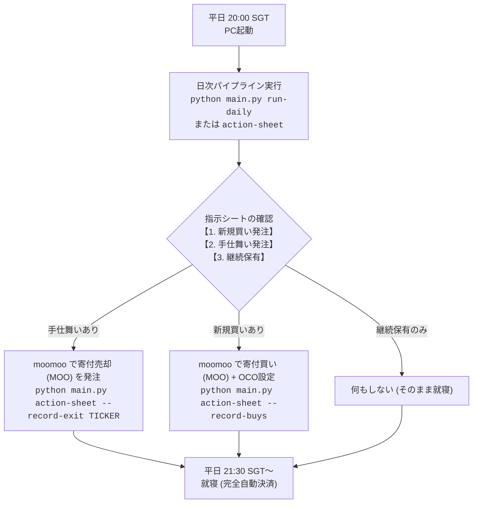

# AlphaIgnitor3 実運用・取扱説明書 (moomoo手動発注 / 就寝中自動運用ガイド)

本書は、**AlphaIgnitor3** のAIゼロショットアンサンブル予測および戦略最適化エンジンを活用し、**moomoo 証券アプリ** を通じて平日夜間に安全・確実に米国株スイングトレードを実施するための公式取扱説明書です。

---

## 1. 運用モデル概要

| 項目 | 設定・仕様 | 備考 |
|---|---|---|
| **運用資金 (Capital)** | **$35,000.00 USD** | [`config/trading.yaml`](file:///home/yuichi/workspace/AlphaIgnitor3/config/trading.yaml) でいつでも変更可能 |
| **活動拠点・タイムゾーン** | **シンガポール時間 (SGT, UTC+8)** | 日本時間 (JST) より1時間遅れ |
| **PC操作推奨時間** | **平日夜 20:00 〜 21:30 SGT** | 米国市場オープン前の約1時間半 |
| **利用証券アプリ** | **moomoo (標準モバイル / デスクトップ)** | 米国株対応 |
| **注文種別** | **MOO (Market On Open / 寄付成行)** | オープン前に予約発注可能 |
| **就寝中自動決済** | **OCO / Bracket 注文 (利確指値 + 損切逆指値)** | 約定後、完全自動で監視・執行 |
| **ポートフォリオ枠** | **最大 3 銘柄 (1スロット約 $11,600 USD)** | 資金効率と分散リスクの最適化 |
| **基本保有期間** | **最大 4 営業日 (スイングトレード)** | 満期または反転時に朝の寄付で手仕舞い |

---

## 2. 毎日のルーティン（日次運用の流れ）



### ステップ 1: 指示シートの確認 (SGT 20:00〜21:30)
ターミナルで以下のコマンドを実行します。
```bash
python main.py action-sheet
```
※ 日次バッチ実行（`python main.py run-daily`）を実行した場合は、最後に自動表示されます。

**【出力画面の見方】**
```text
================================================================================
📋 moomoo 発注アクションシート (As-of: 2026-08-21 / 操作推奨: 平日 20:00〜21:30 SGT)
   運用資金: $35,000.00 USD | 最大保有枠: 3 銘柄 | 空き枠: 3 銘柄
================================================================================

【1. 新規買い発注】（米国市場オープン前: MOO 寄付成行 + OCO設定）
  [1] ALK (予測リターン: +7.49%, 合意: all)
      ・注文種別 : MOO (寄付成行 買)
      ・発注数量 : 287 株 (約 $11,603.47 USD)
      ・OCO設定 : 利確(TP) $42.05 (+4.0%) / 損切(SL) $37.60 (-7.0%)
  [2] VRT (予測リターン: +7.23%, 合意: all)
      ・注文種別 : MOO (寄付成行 買)
      ・発注数量 : 44 株 (約 $11,531.56 USD)
      ・OCO設定 : 利確(TP) $272.56 (+4.0%) / 損切(SL) $243.74 (-7.0%)

【2. 手仕舞い発注】
  ・手仕舞い対象なし

【3. 継続保有 (放置)】
  ・なし
================================================================================
```

---

### ステップ 2: moomoo アプリでの発注手順

#### A. 新規買い発注の場合
1. moomoo アプリを開き、銘柄（例: `ALK`）を検索して **「取引 (Trade)」** をタップします。
2. **注文タイプ (Order Type)**: `Market On Open (MOO)` または `Market (成行)` を選択します。
   - ※ プレマーケット時間外では通常「Market」を選択すると自動的に寄付執行対象（開場時約定）になります。
3. **数量 (Quantity)**: 指示シートに表示された **株数（例: 287株）** を入力します。
4. **複合注文 / Bracket注文 (Attached Orders)**:
   - **利確指値 (Take Profit / TP)**: シートに記載された価格（例: `$42.05`）を入力。
   - **損切逆指値 (Stop Loss / SL)**: シートに記載された価格（例: `$37.60`）を入力。
   - **有効期間 (Time-in-Force)**: `GTC (Good-'Til-Canceled / 取消まで有効)` を選択。
5. **「買い (Buy)」** をタップして送信します。

> [!TIP]
> **OCO (One-Cancels-Other) の仕組み**
> 寄付で買い約定後、moomooのサーバー側で利確指値と損切逆指値が自動稼働します。
> 目標株価に達すれば利確決済され、損切注文は自動キャンセルされます（就寝中に完全自動で処理されます）。

#### B. 手仕舞い（売却）発注の場合
指示シートの「【2. 手仕舞い発注】」に銘柄が表示されている場合：
1. moomoo の保有ポジションから該当銘柄（例: `NVDA`）を選択します。
2. 既存の OCO 注文が入っている場合は一旦キャンセルし、**「売却 (Sell)」** ➔ **「寄付成行 (MOO / Market)」** で全株売却を発注します。
3. ターミナルで手仕舞い記録を実行します：
   ```bash
   python main.py action-sheet --record-exit NVDA
   ```

---

### ステップ 3: ポジションの記録
moomoo で新規買い発注を完了したら、システムにポジションを記録します：
```bash
python main.py action-sheet --record-buys
```
- これにより、`cache/active_positions.json` に銘柄、株数、買値、OCO価格、エントリー日が保存されます。
- 翌日以降、空きスロット数や保有日数が自動追跡され、4営業日経過時の満期決済や逆シグナル検知が正確に行われます。

---

## 3. コマンドリファレンス

| コマンド | 説明・用途 |
|---|---|
| `python main.py action-sheet` | 最新データに基づく**今夜の発注指示シート**を表示 |
| `python main.py action-sheet --record-buys` | 提示された新規買い注文を**保有中ポジションとして記録** |
| `python main.py action-sheet --list-positions` | 現在保有中のポジション一覧（株数、損益、保有日数）を確認 |
| `python main.py action-sheet --record-exit <TICKER>` | 指定銘柄を手仕舞い済みとして記録から削除（例: `--record-exit AAPL`） |
| `python main.py action-sheet --clear-positions` | 保有ポジションの記録をすべて初期化 |
| `python main.py run-daily` | データダウンロード・予測・レポート生成・発注シート出力の一括実行 |
| `python main.py optimize-strategy --months 6 --trials 100` | 過去半年間のデータから**最高利益ルールをOptunaで自動探索** |
| `python main.py backtest --months 6` | 現在の設定ルールで**過去半年間の詳細バックテストを実行**しHTMLを出力 |

---

## 4. 保有状況の確認例

```bash
python main.py action-sheet --list-positions
```
**出力例:**
```text
📦 現在保有中ポジション (2 件):
  ・ALK: 287株 @ $40.43 (Entry: 2026-08-21, 保有: 1日, TP: $42.05, SL: $37.60)
  ・VRT: 44株 @ $262.08 (Entry: 2026-08-21, 保有: 1日, TP: $272.56, SL: $243.74)
```

---

## 5. 設定ファイル (`config/trading.yaml`) のカスタマイズ

運用の資金力やルールは [`config/trading.yaml`](file:///home/yuichi/workspace/AlphaIgnitor3/config/trading.yaml) でいつでも変更できます。

```yaml
capital:
  initial_cash_usd: 35000.0        # 運用資金 (増資・出金時はここを変更)
  currency: USD

portfolio:
  max_slots: 3                     # 最大同時保有銘柄数 (3スロット)
  slot_size_pct: 0.3333            # 1銘柄あたりの配分比率 (約 1/3)
  min_cash_buffer_usd: 500.0       # 手数料・端数バッファ現金

strategy:
  holding_days: 4                  # 最大保有日数 (スイング: 4営業日)
  take_profit_pct: 0.040           # 利確幅 (+4.0%)
  stop_loss_pct: null              # 通常損切 (null: 満期または反転決済)
  emergency_stop_loss_pct: 0.070   # 非常時ディザスターストップ (-7.0%)
  consensus_level: majority        # 3モデル合意基準 (majority: 過半数)
  min_predicted_return: 0.015      # 期待リターン下限 (+1.5%)
  use_q10_filter: true             # q10 不確実性フィルター (下振れリスク排除)
  exit_on_down_signal: true        # 翌日予測が下落(DOWN)に転換した場合に即エグジット

execution:
  broker: moomoo
  order_type: MOO                  # 寄付成行
  user_timezone: Asia/Singapore    # SGT
  operating_hours: "20:00-24:00 SGT"
  slippage_pct: 0.0005             # 寄付スリッページ想定 (0.05%)
  commission_pct: 0.0005           # moomoo 手数料想定 (0.05%)
```

---

## 6. よくある質問 (FAQ) & トラブルシューティング

### Q1. 発注シートに「新規買い発注なし」と表示されます。
**A.** 以下のいずれかの理由です：
1. すでに最大保有枠（3銘柄）が埋まっている。
   - `python main.py action-sheet --list-positions` で現在の保有状況を確認してください。
2. 本日のAI予測モデルにおいて、期待リターンが基準値（+1.5%以上）を満たす銘柄、または過半数合意（majority）に達した銘柄がなかった（無理にエントリーしない安全設計です）。

### Q2. 資金を $50,000 USD に増やしたい場合はどうすれば良いですか？
**A.** [`config/trading.yaml`](file:///home/yuichi/workspace/AlphaIgnitor3/config/trading.yaml) の `initial_cash_usd: 50000.0` に変更するだけで、自動的に1スロットあたりの発注株数が再計算されます。

### Q3. 寄付で成行買いしたあと、利確・損切にヒットせず4日経過した場合は？
**A.** 保有日数が4日目に達すると、発注シートの「【2. 手仕舞い発注】」に「満期到達 (4日保有) ➔ 寄付成行 全株売却」と表示されます。moomooで売却成行を発注し、`--record-exit 銘柄名` を実行してください。

### Q4. バックテストの詳細グラフや月次推移を確認したい。
**A.** ブラウザで [`report/backtest/backtest_report.html`](file:///home/yuichi/workspace/AlphaIgnitor3/report/backtest/backtest_report.html) を開いてください。資産曲線チャート、勝率、ドローダウン、全トレード明細がインタラクティブに確認できます。
